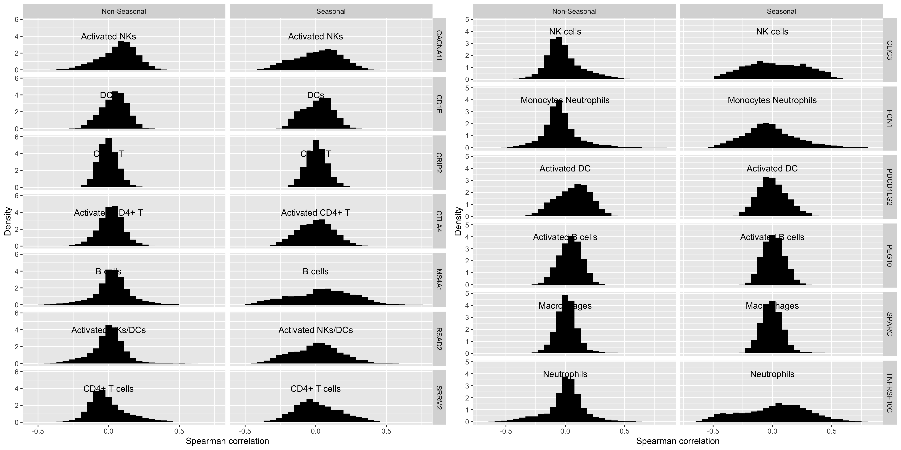

# Seasonal Genes
This project is an attempt on reproducing the following paper results:
[Dopico, X., Evangelou, M., Ferreira, R. et al. **Widespread seasonal gene expression reveals annual differences in human immunity and physiology**.  _Nat Commun 6, 7000 (2015)_](https://doi.org/10.1038/ncomms8000).

The paper shows how some genes change their expression profiles depending on the season. There is a noticeable difference between summer and winter, and interestingly, this pattern is reversed in the southern hemisphere.

The gene expression is measured with microarrays of different manufacturers. I happened to have worked with this data in the past following the paper methods. It uses a cosine linear model which I implemented and I was able to observe the same pattern. Sadly, I lost the code since then, so I decided to recreate it. In order to make things interesting, and knowing that reproducibility in bioinformatics has never been a guarantee (despite having perfectly deterministic computing devices), I decided to extend the scope of the project and test to what extent is possible to reproduce the results.

There are two conditions to this goal, though:
- Since I don't currently hold any affiliation, the data should be completely open for anybody that wish to download it.
- Ideally, the code should go trough all the steps without human intervention, including downloading the data. Still, I had to leave a few files with important data in this repository.

Since the paper is [open access](https://www.springernature.com/gp/open-research/about/the-fundamentals-of-open-access-and-open-research) I left a pdf copy of it alongside its supplementary information. You should give it a read (or two) to understand what is going on.

Performing a different statistical analysis is not the intent of this project, at least for the moment.
## Author
[David Flores](https://github.com/dflores1)
## Data
This is the breakdown of the datasets used in the paper. We will see that from all datasets, only one is actually usable.
### Microarray data
#### Babydiet and T1D
This is the microarray data where the paper based the study and performed the initial seasonal gene analysis. You can find it in ArrayExpress under the following accession code [E-MTAB-1724](https://www.ebi.ac.uk/biostudies/arrayexpress/studies/E-MTAB-1724?query=E-MTAB-1724).

There is missing a vital piece of information on the metadata, which is the blood sampling date. Without it, it's impossible to reproduce the results entirely. However, some of these results can be access trough an excel file provided in the supplementary material. The information provided in this file is used to compare the results with the asthma dataset.
#### Asthma cohort
Another microarray dataset with accession code [E-GEOD-19301](https://www.ebi.ac.uk/biostudies/arrayexpress/studies/E-GEOD-19301?query=E-GEOD-19301). The **good news** are that the metafile comes with the blood extraction date. In ArrayExpress, this file file is called [SDRF](ftp://ftp.ebi.ac.uk/biostudies/nfs/E-GEOD-/301/E-GEOD-19301/Files/E-GEOD-19301.sdrf.txt).

This dataset is divided in four groups:
- United States.
- Australia.
- United Kingdom and Ireland.
 - Iceland.
 
Thanks to these distinct four geographical locations, it is an interesting dataset. We can observe a seasonal pattern in some genes that is reversed in the southern hemisphere, as well as, a diminished pattern in the most northern location.

#### Subcutaneous adipose tissue
One more microarray data study with accession code [E-TABM-1140](https://www.ebi.ac.uk/biostudies/arrayexpress/studies/E-TABM-1140?query=E-TABM-1140). Once again, the vital information of blood extraction dates are nowhere to be found and it makes impossible to replicate the results.

### Full blood count
#### UK Cohort
This data is under the management of the [Cambridge Bioresource](https://bioresource.nihr.ac.uk). Access to the data is trough an application process which is beyond the limits of a individual with no affiliation. Moreover, it is not possible to integrate the automatic data download in the code.
#### Gambian cohort
This data is under the management of the [Keneba Biobank](https://www.lshtm.ac.uk/research/units/mrc-gambia/keneba). Once again, access to it is trough an application process that is not available if you are not affiliated to an institution. There is no possibility of downloading the data automatically either.
## Script
Originally, I had the ambitious idea of  managing the different datasets with different R scripts that will download and perform the data processing. Since only the asthma dataset is actually workable, theres is only one _Rscript_. Unfortunately, I couldn't do anything with the rest of the data, see reasons above.

If you want to re-create the figures, just run the asthma R script. Some of the steps take some time. The script saves partial data on _rds_ serialised files in case you want to tinker with the script.
### Data download
The asthma microarray data is downloaded directly from _ArrayExpress_. That means that we depend on a external factor for reproducibility. The script will work as long as the data is accesible, and they don't change the ftp links. Based on my experience, this will inevitably happen at some point in the future, and the only possible thing to do is to update the code when that happens.
### Nix
Any attempt on reproducibility on bioinformatics will have to deal with the problem of software and software versions. There are many approaches that try to solve this problem.  In this case I chose to use Nix as a packet manager. 

You can see the _Nix _expression in the _shell.nix_ file. If you are already a [Nix or NixOS](https://nixos.org) user, just type _nix-shell_ on the directory and let the software get installed. The package versions are pinned and the results are expected to be consistent with the future.

if you don't use _Nix_, still have a look at that file and see what you need to have in your system.

Also, I am aware that there are new tools available in the Nix community. One of them is [flakes]( https://nixos.wiki/wiki/Flakes). I didn't have too much time to look into them or other possible tools, but if you think you can improve this codebase, please go ahead.
## Comparing results

We can observe a similar seasonal pattern in both analysis. There are some differences, including the number of seasonal genes detected. It can be explained by how the microarray data has been processed, or the actual implementation of the cosine model.

My cosine model implementation also observes an anti-pattern in the Australian cohort. I had to extract the seasonal _BabyDiet_ genes from the excel file in the supplemental data to produce this figure.

Unfortunately, my figure fails to observe the same correlation with inmune characteristic lineage genes. It is not clear with what dataset this correlation was calculated, I might have mistankely chosen the asthma cohort.
### Discusion
As an exercise on reproducibility, I think this shows how difficult could be to get the same results or even try to replicate the same computational steps. Most of the data is there, but it is missing vital parts for replication. Probably this happens with most of the published literature in bioinformatics. Publishing a paper is hard enough to even consider putting some effort on a reproducible pipeline, so most of the groups they do their best to share the methodology.
## License
This program is free software: you can redistribute it and/or modify it under the terms of the GNU General Public License as published by the Free Software Foundation, either version 3 of the License, or (at your option) any later version.
This program is distributed in the hope that it will be useful, but WITHOUT ANY WARRANTY; without even the implied warranty of MERCHANTABILITY or FITNESS FOR A PARTICULAR PURPOSE. See the GNU General Public License for more details.
You should have received a copy of the GNU General Public License along with this program. If not, see <https://www.gnu.org/licenses/>
